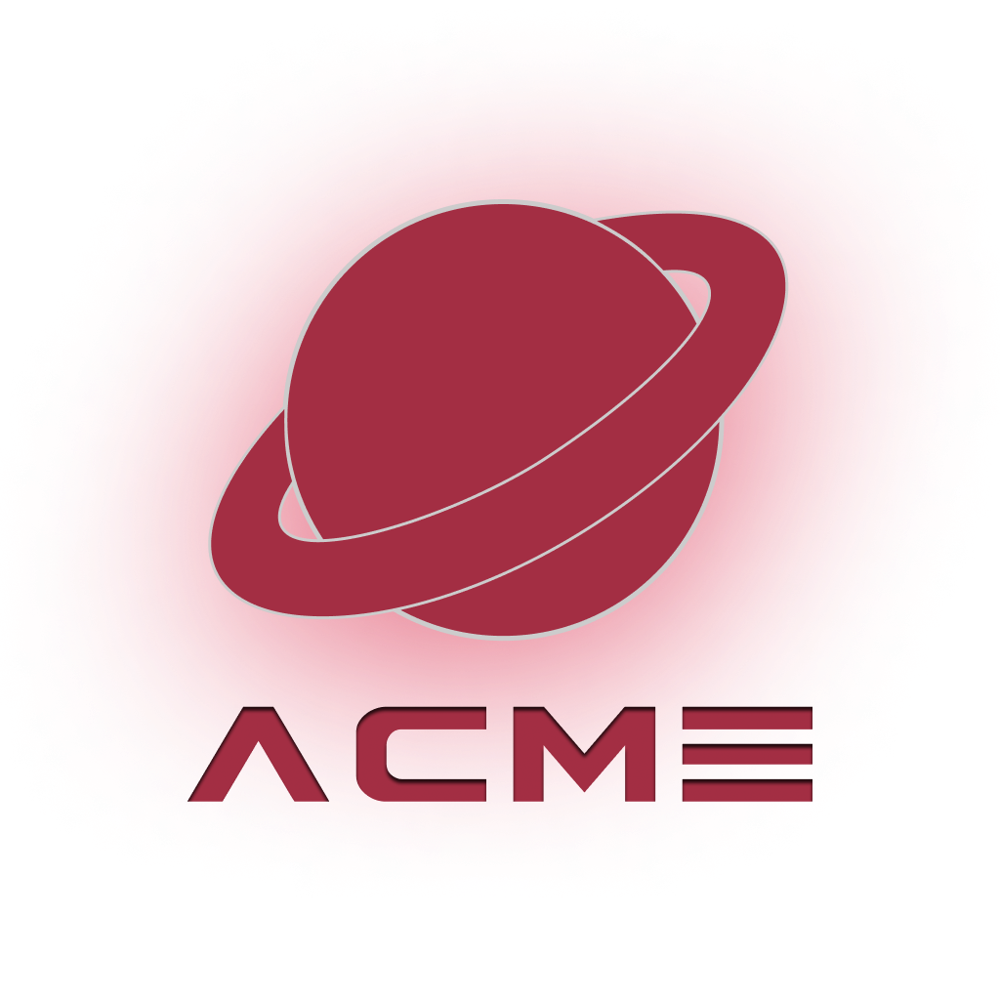

  
    
  <strong>Desenvolvimento Mobile com React Native</strong>
    
  <strong>Assessment • AT</strong>
    
  <strong>Professor: Tiago Luiz Ribeiro da Silva</strong>
    
  <strong>Aluno: André Luis Becker</strong> 

#

  <h2>Sistema de Compras - ACME</h2>

  

> [!IMPORTANT]
> Apresentação - Sistema de compras (completo) em React.JS. 

#

  
  
  

> Grato por sua visita! :clap: 
 

> André Luis Becker &copy; Todos os direitos reservados. 
